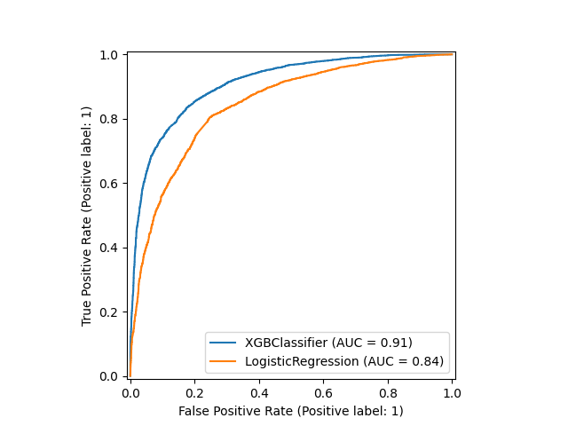
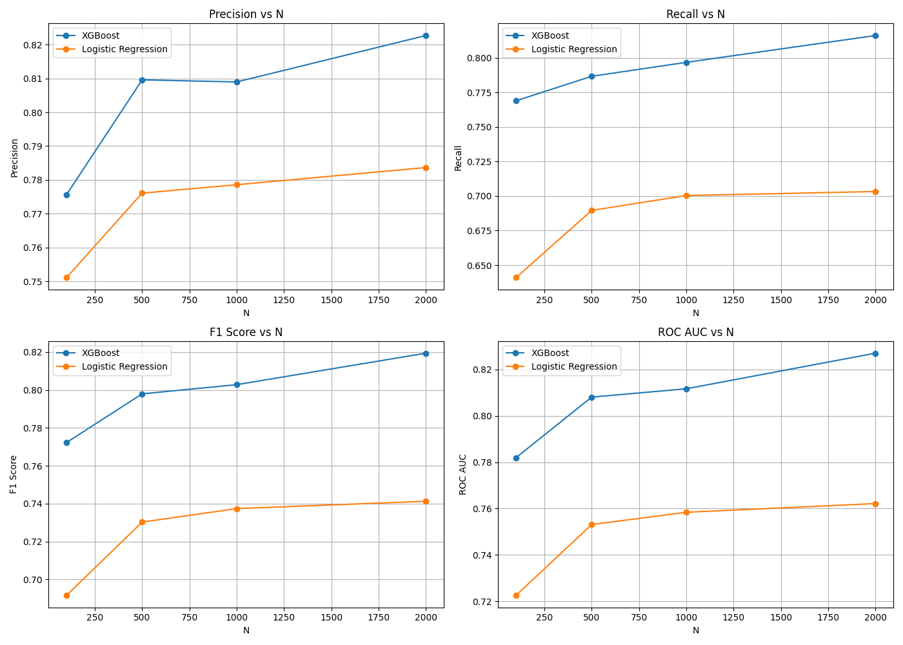

# Reusult's report
## Berkeley Hass Coding Challenge
### Ulises Quevedo - June 2024

The following report documents findings from the coding challenge assigned. The challenge consisted on training a **binary classifier** to categorize tweets as either **poisitve or negative** based on the tweets text. The tweets Entity was also available, although it was not used for reasons outlined below. The report is structured as follows:

1. Executive summary
2. Data pre-processing overview (`data_prep.py`)
3. Modelling overview (`modelling.py`)
4. Results + Other questions
5. Conclusion


# 1. Executive summary

- We **use only tweets with positive / negative sentiment**, dropping those with Irrelevant or Neutral label
- We preprocess tweets text with a standard pipeline: **lowercasing, tokenization by words, removal of punctuation and stopwords**
- We create **"weight" features** for each tweet, based on the frequency of words in positive/negative tweets. We repeat this with bigrams, which ***prove less useful but allow us to find patterns such as names** ("Assassins Creed", "Red Dead"). We add **length of tweet** as an additional feature.
- We package all preprocessing into a **scikit-learn pipeline** to make it modular and easy to modify.
- We train two models: a logistic regression based only on weight features and an XGBoost classifier based on weight features + length. We **fine tune both using optuna** and a validation dataset, seeking to maximize the ROC AUC metric. 
- We present a report for different classification method and explore the effect of vocabulary size on models' performance. We find **larger vocab** models are better, and that **XGBoost** preforms better than a vanilla logistic regresion. Likewise, we find that **tweet length** turns out to be a very important feature. 


# 2. Data preprocessing

We first preprocess the data. Since we are working with tweets, it is natural to process the text of the tweets using the standard NLP procedure: tokenization, removal of punctuation and removal of stopwords. While stemming and lemmatization are quite standard as well, we do not use them here. 

## Features 

We create 4 features for each tweet: positive and negative word and bigram weights. These are based on a word (bigram) set that counts the N most frequent words (bigrams) in positive and negative tweets. We then substitute each word (bigram) of a tweet with its weight (giving a weight of 0 if not in the set) and add them up, to find a positive/negative weight. The following code snippet shows how the dictionaries were built, and how the weight is assigned


```python
def get_top_N_words(dataframe, N=100, sentiment="Positive", stop_words=stopwords.words('english')):
   
    # Filters tweets to relevant sentiment
    relevant_tweets = dataframe.query("Sentiment == '{}'".format(sentiment))["Content"].dropna()
    # Makes them lowercase
    lower_tweets = relevant_tweets.apply(str.lower)
    # Removes punctuation signs
    no_punctuation = lower_tweets.apply(lambda x: x.translate(str.maketrans('', '', (string.punctuation+"’0123456789"))))
    # Tokenizes
    tokenized_tweets = no_punctuation.apply(word_tokenize)
    # Removes punctuation and stopwords
    stop_words = set(stopwords.words('english'))
    no_stopwords = tokenized_tweets.apply(lambda x: [word for word in x if word not in stop_words])

    corpus = sum(no_stopwords, [])

    word_counts = Counter(corpus)
    top_N_words = word_counts.most_common(N)

    return dict(top_N_words)


def get_word_weight(tweet, dictionary, stop_words=stopwords.words('english')):
    """
    Calculates the weight of a tweet based on a given dictionary of word weights.

    Parameters:
    tweet (str): The tweet to calculate the weight for.
    dictionary (dict): A dictionary containing word weights.
    stop_words (list, optional): A list of stop words to be excluded from the tweet. Defaults to stopwords.words('english').

    Returns:
    float: The weight of the tweet based on the word weights in the dictionary.
    """

    # Filters tweets to relevant sentiment
    tweet = tweet.lower().translate(str.maketrans('', '', (string.punctuation+"’0123456789"))).split()
    tweet = [word for word in tweet if word not in stop_words]

    weight = sum([dictionary[word] if word in dictionary else 0 for word in tweet])

    return weight
```

Additionally, we include the **tweet's length** as a feature. This under the hypothesis that negative tweets might be longer than positive tweets (people tend to hate on things more than praise). To check this, we carry out a quick EDA that shows that negative tweets are in average longer (this difference proves to be statistically significant through a t-test, but we use this only as a motivating factor).

## Pipeline

In order to make our code as modular and clean as possible, we take advantage of scikit-learn's pipeline interface. We create three classes for preprocessing:

1. TweetCleaner: Removes tweets with Irrelevant or Neutral labels, drops na's (tweets with no content) and remaps our label to 0 (Negative) and 1 (Positive)
2. TweetFeatureExtractor: Creates the features outlined above. We implement fit and transform methods, we fit the word/bigram dictionary on the training data and transform the test and validation data with this.
3. DF_Cleaner: Splits the dataset into Features and Labels, keeping only relevant columns

## Splitting

We follow a pretty standard policy for data splitting, since there is no temporal element to care for. Since classes are well balanced (22542 Negative vs 20832 Positive), we use a regular split, but stratify our samples just for good measure. We **save 20% of the data (8698 examples) for testing**, and the remaining 80% is **split again into testing and validation, with a 20% validation set (27886 testing, 6972 validation)**

The processing pipeline ends by creating the datasets and their labels and saving these csv files. 

# 3. Modelling

The modelling pipeline tries two different classification models, and tunes each of them using the optuna library. We try a vanilla Logistic Regression, which takes only the weight features we created, and we try an XGBoost model, which takes those features plus the tweet's length. We use XGBoost since it offers some of the best preformance out of the box. 

## Metric

**We choose ROC AUC as our metric to optimize for**. Since we do not have a lot of knowledge about this specific problem, we do not care more for precison or recall. As such, AUC is a good metric since we care equally for both classes, the dataset is balanced and we do not prefer recall or precision. 

## Tuning

We use the optuna library to tune both our models, in order to pit the "best" models against eachother. We use a validation dataset to tWhile XGBoost offers a lot of customization, in linear regression we can only really tune regularization parameters. For XGBoost, we search over the following:

```python
params = {
        "objective": "binary:logistic",
        "n_estimators": trial.suggest_int("n_estimators", 50, 500),
        "verbosity": 0,
        "learning_rate": trial.suggest_float("learning_rate", 1e-3, 0.1, log=True),
        "reg_alpha":trial.suggest_float("reg_alpha", 1e-3, 10.0, log=True),
        "reg_lambda": trial.suggest_float("reg_lambda", 1e-3, 10.0, log=True),
        "max_depth": trial.suggest_int("max_depth", 1, 10),
        "subsample": trial.suggest_float("subsample", 0.05, 1.0),
        "colsample_bytree": trial.suggest_float("colsample_bytree", 0.05, 1.0),
        "min_child_weight": trial.suggest_int("min_child_weight", 1, 20),
    }
```

Our search spaces are defined more by common practice than domain knowledge, using mostly recommended ranges. We carry out 100 tuning trials for both models. 

## Evaluation
Once the models have been tuned, we calculate the typical binary classification metrics: precision, recall (over positive class), f1 score and AUC. Even though we care for the last metric mainly, it is good practice to calculate all in case we later choose a different one.


# 4. Results

We run the proces above for 4 different vocab sizes (number of words in the top N frequency): [100, 500, 1000, 2000]. We choose this values somewhat arbitrarily (this is yet another hyperparameter we could optimize over), but we choose this based on the number of unique words in the dataset (~2200). 

## Model performance

In all cases, XGBoost preformed better then the vanilla Logistic regression. While this does not come as a surprise, it does suggest that even more preformance could be teased out through the correct feature modelling and model tuning. Below we present the ROC curves for all 4 trials, as well as a results table for each N and each metric for each model. 

| Model               | N    | Precision          | Recall             | F1 Score           | ROC AUC            |
|---------------------|------|--------------------|--------------------|--------------------|--------------------|
| XGBoost             | 100  | 0.7756 | 0.7689 | 0.7723 | 0.7819  |
| Logistic Regression | 100  | 0.7511  | 0.6409 | 0.6917 | 0.7226 |
| XGBoost             | 500  | 0.8095 | 0.7867  | 0.7980 | 0.8081 |
| Logistic Regression | 500  | 0.7760 | 0.6896 | 0.7303 | 0.7531 |
| XGBoost             | 1000 | 0.8090 | 0.7967 | 0.8028 | 0.8116 |
| Logistic Regression | 1000 | 0.7786 | 0.7004 | 0.7374 | 0.7583 |
| XGBoost             | 2000 | 0.8227 🏆  | 0.8162 🏆| 0.8194 🏆 | 0.8270 🏆 |
| Logistic Regression | 2000 | 0.7836 | 0.7033 | 0.74123 | 0.7621 |

### ROC for different vocab sizes (N)
**N = 100**

**N = 500**

**N = 1000**

**N = 2000**


## Effect of vocab size

We experiment to see the effect of vocabulary size on model performance. For both models, increasing the vocabulary size improved performance at test time. While this is not surprising (a larger vocabulary gives more information to the weight features), it suggest there is value in exploring the tweet's text further.

The following graph shows the effect of vocabulary size on the 4 relevant metrics.



# 5. Conclusion

In general, this was a fun iteration of a simple binary classification problem. There is a lot of room for improvement, but in general it sets a solid foundation for iteration and exploration. 

## What went well, what didn't

### Good: 
- **Modularity**: The code turned out to be very modular, which mean expanding should be very easy
- **Model Improvement**: The proposed model was better than a vanilla model (and than random guessing)
- **Good practices**: The process follows ML good practices on validation and testing, model comparison, etc. 
### Bad:
- **Simplicity**: The exploration is quite simplistic, and there is not a lot of feature engineering or model testing, which could have yielded better results
- **Imperfect replicability**: Although we tried to keep the process as replicable as possible (see random states of splits), we missed some random states on the optimization and model creation steps. We do not, for example, store our "best" model's parameters.
- **Express NLP**: While we follow standard NLP procedures, we miss some stop words (such as `im`). The NLP pipeline can be improved. 


## Possible improvements and future work
We identify the following 3 actionable improvements over this project:

1. **Feature engineering**: We did not use the "Entity" column, which could have been used through some encoding procedure as a feature. Other features were not explored. 
2. **Model exploration**: We tried only 1 model (XGBoost). Although a good choice, it might have been worth it to try a broader set of models
3. **Advanced NLP + Transformers**: We do not leverage SOTA NLP techniques (word embeddings) which could generate some other interesting features. On the same note, we could implement SOTA Transformer models such as BERT to try to get a better performance. 